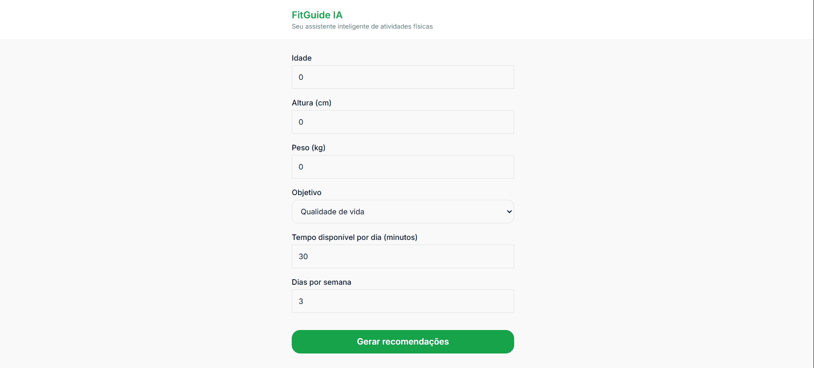

# 🏋️ FitGuide IA

FitGuide IA é uma aplicação mobile-first que utiliza Inteligência Artificial para gerar recomendações personalizadas de atividades físicas com base no perfil do usuário.

O projeto foi desenvolvido com foco em experiência do usuário, simplicidade e boas práticas de frontend, sendo ideal para uso em dispositivos móveis.

## Demonstração prática



## 🚀 Funcionalidades

- Interface Mobile-First

- Recomendações personalizadas de exercícios com IA

- Persistência de dados com LocalStorage

- Opção de gerar novas recomendações

- Validação de dados do formulário

- Aplicação 100% frontend

## 🛠️ Tecnologias Utilizadas

- React

- TypeScript

- Vite

- Tailwind CSS v4

- Google Gemini 2.5 Flash API

- Netlify

## 📁 Estrutura do Projeto
```bash
src/
components/
Form/
Recommendation/
ui/
services/
types/
utils/
main.tsx
```

## 🔐 Variáveis de Ambiente

Crie um arquivo .env na raiz do projeto:

VITE_GEMINI_API_KEY=your_api_key_here

O arquivo .env está incluído no .gitignore e não deve ser versionado.

## ▶️ Executando o projeto localmente
```bash
npm install

npm run dev

A aplicação ficará disponível em:

http://localhost:5173
```

## ⚠️ Aviso Importante

**Este aplicativo não fornece diagnósticos médicos.**

**As recomendações são apenas orientações gerais voltadas à saúde e qualidade de vida.**

**Sempre consulte um profissional de saúde antes de iniciar qualquer atividade física.**

## ✨ Autor

Brenno Henrique do Nascimento

Frontend Developer • React • TypeScript • UI/UX

### 📄 Licença

Projeto desenvolvido para fins educacionais e demonstrativos.